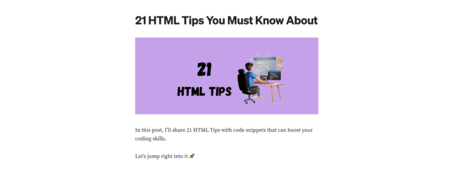

# Clone de uma página HTML

Esta é uma atividade individual.

Nesta atividade vamos reecriar uma página HTML para que possamos aplicar os conceitos de HTML e CSS vistos até o momento. 

Vamos recriar uma página do <a href="https://medium.com/" target="_blank">Medium</a> que é uma plataforma de publicação de conteúdo.

A página escolhida foi a publicação <a href="https://blog.stackademic.com/21-html-tips-you-must-know-about-f771c05713c0" target="_blank">21 HTML Tips You Must Know About</a>.

Para a atividade, vamos remover alguns elementos da página original, como a barra superior, rodapé e alguns trechos de texto do artigo.

Veja a seguir a versão simplificada da página que você deve recriar.

___
# Instruções
## Criando o código HTML

Crie um arquivo chamado `index.html` e escreva o código HTML referente à página acima.

Lembre-se que ao escrevermos o código HTML, devemos pensar sempre em semântica e nunca em visual.

Desta forma, escreva o código HTML utilizando as tags semânticas que você achar mais adequadas. `h1`, `h2`, `h3` ... para títulos, `p` para parágrafos, `ul` e `li` para listas e assim por diante.

Lembre-se que o código HTML deve ser um código válido. Caso você tenha dúvidas sobre o que é um código HTML válido ou queira verificar se o seu código está correto, volte para o handout <a href="https://devlife.insper-comp.com.br/aulas/design/introducao-ao-html/estrutura/" target="_blank">Estrutura Básica</a>.

- As imagens necessárias para a atividade estão disponíveis na pasta `img`.
- Os símbolos <> podem ser escritos com o código `&lt;` e `&gt;`.
- Os códigos HTML exemplo presentes no artigo podem ser escritos com a tag `pre`, para mais detalhes faça uma pesquisa sobre a tag. 

> :warning: **Faça um commit**: Faça commits durante o desenvolvimento do código HTML. Você pode realizar quantos commits jugar necessário. Mas ao finalizar o código HTML e antes de começar a próxima etapa, faça um commit com a mensagem "Código HTML finalizado".

## Resetando as regras do navegador

Faça o reset das regras padrão do navegador. Caso você não se lembre como fazer isso, consulte o handout <a href="https://devlife.insper-comp.com.br/aulas/design/introducao-ao-css/css3/requisitos/#resetando-as-regras-do-navegador" target="_blank">Resetando as regras do navegador</a>.

> :warning: **Faça um commit**: Faça um commit com a mensagem "Reset das regras do navegador".

## Criando o código CSS

Crie um arquivo chamado `style.css` e escreva o código CSS referente à página acima.

## Rubrica

Será feita uma inspeção visual, ou seja, os tamanhos, distâncias e cores não precisam ser exatamente iguais, mas devem ser visualmente bastante parecidos.

- **I**: Não entregou ou o código HTML é quase inexistente.
- **D**: Entregou apenas o código HTML ou o código CSS é quase inexistente.
- **C**: Entregou o código HTML e CSS, além disso:
    - A página está com a aparêcia similar ao do exemplo, mas com algumas diferenças.
    - O código HTML é um código válido (sem erros de sintaxe).
- **B**: Entregou o código HTML e o código CSS, além disso:
    - A página está com a aparência similar ao do exemplo.
    - Utilizou um arquivo para resetar o CSS padrão do navegador.
    - O código HTML foi escrito de forma semântica.
    - Não utilizou posicionamento absoluto para alinhar os elementos.
    - Realizou os commits conforme solicitado pelo enunciado.
- **A**: Entregou o código HTML e o código CSS, além disso:
    - A página está com a aparêcia muito similar ao do exemplo.
    - Utilizou display flex para alinhar o conteúdo principal da página.
    - Utilizou unidades relativas para definir tamanhos de fontes, margens, paddings e etc.
    - Realizou commits além dos solicitados pelo enunciado, além disso, os commits estão bem descritos.
- **A+**: Implementou o cabeçalho destacado na imagem a seguir:
    

**Observações**:
- Atividade não deve utilizar nenhuma biblioteca CSS ou afins.
- Para este trabalho você não precisa se preocupar com a versão mobile da página. Ela será testada apenas em um monitor.

## Prints

Veja abaixo alguns prints dos trechos da página que você deve recriar.

- Parte 1

- Parte 2

- Parte 3

- Parte 4

- Parte 5

